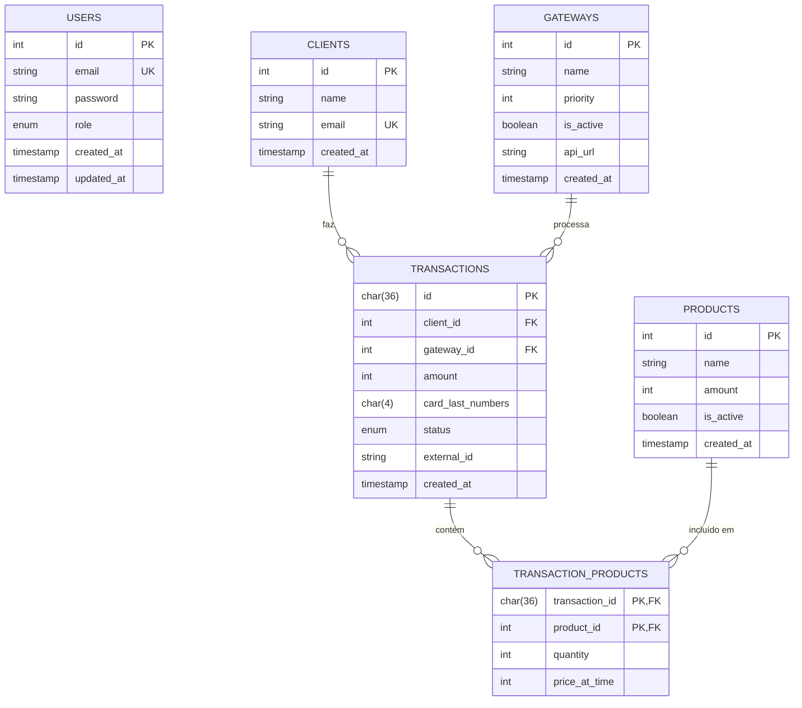

    <h2 class="section-title">🗄️ Arquitetura de Dados: Estratégia Database-First</h2>
    

        <strong>Visão do Especialista:</strong> Esta modelagem foi concebida sob rigorosa observância da 3ª Forma Normal (3NF). Implementamos o conceito de <strong>Snapshots de Preço</strong> na tabela associativa para garantir a auditabilidade financeira — um requisito crítico em sistemas de pagamento onde o preço de um produto no catálogo pode oscilar sem alterar o histórico de transações já efetuadas.
    

<h3> MER</h3>

<h3 class="section-title">1. Tabela: <code>users</code></h3>
    
Armazena credenciais administrativas e níveis de acesso (RBAC).

    <table>
        <thead>
            <tr><th>Coluna</th><th>Tipo</th><th>Restrições</th><th>Descrição</th></tr>
        </thead>
        <tbody>
            <tr><td>id</td><td>INT</td><td>PK, AUTO_INC</td><td>Identificador único do usuário.</td></tr>
            <tr><td>email</td><td>VARCHAR(255)</td><td>NOT NULL, UNIQUE</td><td>E-mail de login.</td></tr>
            <tr><td>password</td><td>VARCHAR(255)</td><td>NOT NULL</td><td>Hash da senha (BCrypt recomendado).</td></tr>
            <tr><td>role</td><td>ENUM</td><td>DEFAULT 'USER'</td><td>Papéis: ADMIN, MANAGER, FINANCE, USER.</td></tr>
            <tr><td>created_at</td><td>TIMESTAMP</td><td>CURRENT_TIMESTAMP</td><td>Data de criação do registro.</td></tr>
        </tbody>
    </table>
    <h3 class="section-title">2. Tabela: <code>gateways</code></h3>
    
Configuração dinâmica para o motor de failover.

    <table>
        <thead>
            <tr><th>Coluna</th><th>Tipo</th><th>Restrições</th><th>Descrição</th></tr>
        </thead>
        <tbody>
            <tr><td>id</td><td>INT</td><td>PK</td><td>Identificador do gateway.</td></tr>
            <tr><td>name</td><td>VARCHAR(100)</td><td>NOT NULL</td><td>Nome ex: 'Gateway 1', 'PagSeguro'.</td></tr>
            <tr><td>priority</td><td>INT</td><td>NOT NULL</td><td>Ordem de tentativa (menor valor = maior prioridade).</td></tr>
            <tr><td>is_active</td><td>BOOLEAN</td><td>DEFAULT TRUE</td><td>Flag de disponibilidade no motor de busca.</td></tr>
            <tr><td>api_url</td><td>VARCHAR(255)</td><td>NOT NULL</td><td>Endpoint base da API do gateway.</td></tr>
        </tbody>
    </table>
    <h3 class="section-title">3. Tabela: <code>transactions</code></h3>
    
Registro mestre de cada intenção de compra processada.

    <table>
        <thead>
            <tr><th>Coluna</th><th>Tipo</th><th>Restrições</th><th>Descrição</th></tr>
        </thead>
        <tbody>
            <tr><td>id</td><td>CHAR(36)</td><td>PK</td><td>UUID v4 para evitar <i>ID Enumeration attacks</i>.</td></tr>
            <tr><td>client_id</td><td>INT</td><td>FK</td><td>Relacionamento com a tabela <code>clients</code>.</td></tr>
            <tr><td>gateway_id</td><td>INT</td><td>FK, NULLABLE</td><td>Gateway que processou o sucesso.</td></tr>
            <tr><td>amount</td><td>INT</td><td>NOT NULL</td><td>Valor total em centavos (Inteiro).</td></tr>
            <tr><td>status</td><td>ENUM</td><td>DEFAULT 'pending'</td><td>Status: pending, paid, refunded, failed.</td></tr>
            <tr><td>external_id</td><td>VARCHAR(255)</td><td>NULLABLE</td><td>ID retornado pelo sistema de terceiro.</td></tr>
        </tbody>
    </table>
    <h3 class="section-title">4. Tabela Associativa: <code>transaction_products</code></h3>
    
Detalhamento dos itens da compra (Suporte a Nível 3).

    <table>
        <thead>
            <tr><th>Coluna</th><th>Tipo</th><th>Restrições</th><th>Descrição</th></tr>
        </thead>
        <tbody>
            <tr><td>transaction_id</td><td>CHAR(36)</td><td>PK, FK</td><td>Vínculo com a transação pai.</td></tr>
            <tr><td>product_id</td><td>INT</td><td>PK, FK</td><td>Vínculo com o catálogo.</td></tr>
            <tr><td>quantity</td><td>INT</td><td>NOT NULL</td><td>Quantidade comprada do SKU.</td></tr>
            <tr><td>price_at_time</td><td>INT</td><td>NOT NULL</td><td>Preço unitário no exato momento da venda.</td></tr>
        </tbody>
    </table>

